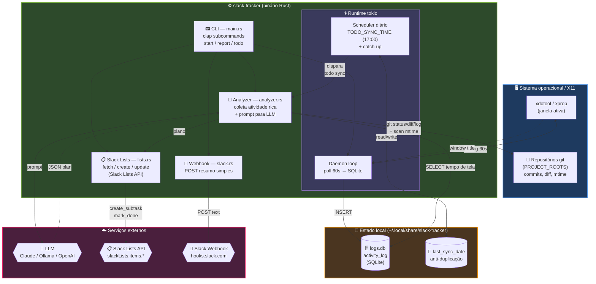
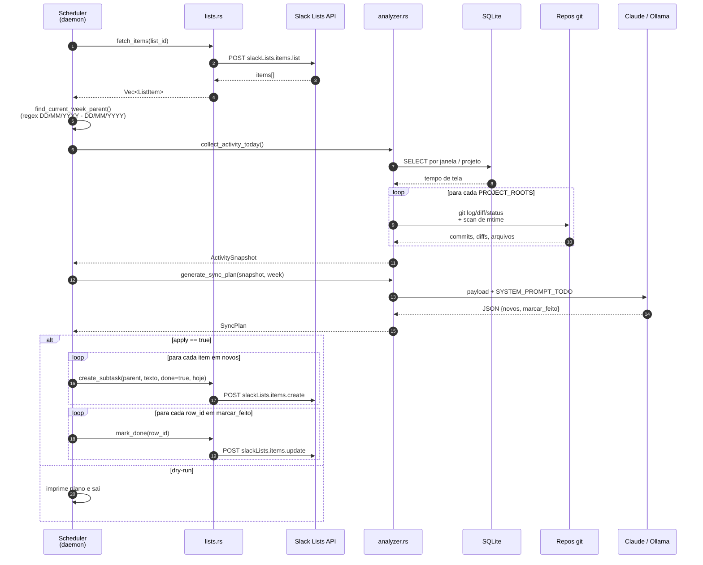
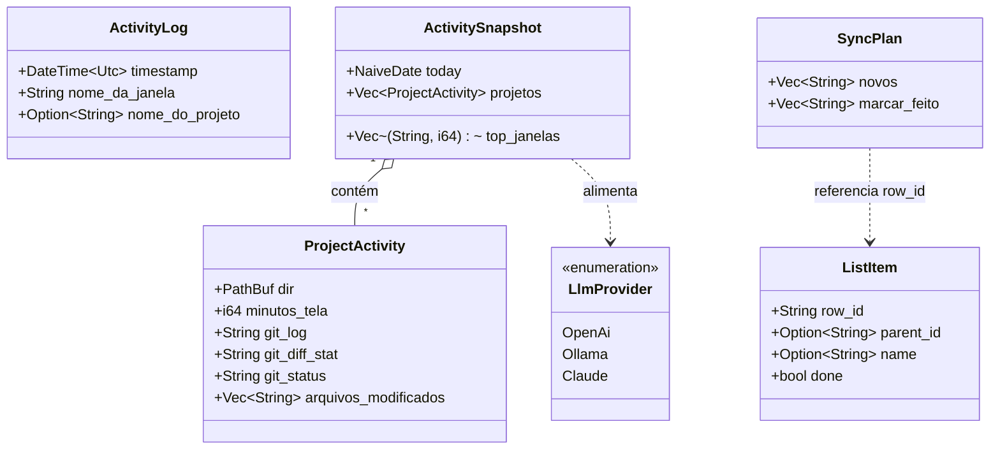

# Arquitetura

Eu organizei o projeto em três módulos pequenos. Cada um faz uma coisa só, e a CLI ([src/main.rs](../src/main.rs)) costura tudo.

## Visão geral em componentes

## Módulos

### Daemon — [src/main.rs](../src/main.rs)

É o processo de longa duração. Ele faz duas coisas em paralelo:

- **Loop de monitoramento** (a cada 60s): chama `xdotool getactivewindow getwindowname` para pegar o título da janela ativa, tenta extrair um nome de projeto via regex (VSCode, RustRover, IntelliJ, PyCharm, Nvim, Sublime) e grava uma linha na tabela `activity_log` do SQLite.
- **Scheduler diário**: roda em uma task `tokio` separada. Calcula o próximo horário-alvo (`TODO_SYNC_TIME`, default 17:00 local), dorme até lá e dispara o `todo sync`. Se o daemon subir depois do horário-alvo e ainda não tiver rodado hoje, ele faz catch-up imediato.

Se o `xdotool` não estiver disponível, eu caio no fallback via `xprop -root _NET_ACTIVE_WINDOW`.

### Analyzer — [src/analyzer.rs](../src/analyzer.rs)

É o módulo que transforma "atividade bruta" em algo que vai virar item de lista. Ele tem dois fluxos:

1. **Resumo simples** (`generate_daily_summary`, usado pelo `report`):
   - lê os top projetos do dia agrupando por `nome_do_projeto` no SQLite,
   - localiza a pasta git de cada projeto vasculhando `~`, `~/Projects`, `~/dev`, `~/Code`, `~/Documents`, `~/Área de trabalho` etc.,
   - roda `git status --short`, `git diff --stat` e `git log --since=6am`,
   - manda tudo pro LLM (`SYSTEM_PROMPT` curto e direto) e recebe bullet points prontos pro Slack.

2. **Coleta rica** (`collect_activity_today` + `generate_sync_plan`, usado pelo `todo sync`):
   - itera apenas as pastas listadas em `PROJECT_ROOTS` (mais preciso),
   - para cada uma, junta `git log --since=midnight`, `git diff --stat`, `git status --short` e os arquivos modificados hoje no disco (com mtime ≥ meia-noite),
   - junta também a lista atual da semana no Slack (pra não duplicar) e
   - pede ao LLM o `SYSTEM_PROMPT_TODO` — um prompt bem mais detalhado que define o tom: primeira pessoa, itens curtos atômicos, máximo 10, sem inventar nada.

O analyzer detecta o provider automaticamente:
- se `SLACK_TRACKER_LLM` estiver setado, ele manda;
- senão, se eu tiver `ANTHROPIC_API_KEY`, vai de Claude;
- senão, se tiver `OPENAI_API_KEY`, vai de OpenAI;
- senão, cai no Ollama local.

### Slack Lists — [src/lists.rs](../src/lists.rs)

Wrapper bem fininho em volta da Slack Lists API. Os endpoints que eu uso:

- `slackLists.items.list` — buscar todos os itens da lista.
- `slackLists.items.create` — criar subtarefa sob um pai (a "semana atual"), já com `name`, `todo_completed=true` e `date`.
- `slackLists.items.update` — marcar uma subtarefa como feita.
- `slackLists.items.delete` — não uso por padrão (está com `#[allow(dead_code)]`), mas deixei pronto.

Os IDs de coluna da minha Slack List (nome, checkbox de feito, data) são lidos das variáveis `SLACK_COL_NAME`, `SLACK_COL_DONE` e `SLACK_COL_DATE`. Se eu mudar a estrutura da lista no Slack, basta atualizar essas variáveis no ambiente.

### Slack Webhook — [src/slack.rs](../src/slack.rs)

Posta uma mensagem simples no canal via `SLACK_WEBHOOK_URL`. Esse caminho é usado só pelo `report --send`, não pelo `todo sync`.

## Fluxo de uma rodada do `todo sync`

Em diagrama de sequência, mostrando quem fala com quem:

Em modo dry-run, os dois loops finais são pulados — o plano só vai pro stdout.

## Persistência

| Caminho | O que tem |
|---|---|
| `~/.local/share/slack-tracker/logs.db` | SQLite com `activity_log(id, timestamp, nome_da_janela, nome_do_projeto)` |
| `~/.local/share/slack-tracker/last_sync_date` | Data ISO do último dia em que o sync rodou (anti-duplicação no scheduler) |

Os dois são criados sob demanda. Se eu apagar o `last_sync_date`, o scheduler considera que ainda não rodou hoje e pode disparar de novo.

## Estruturas de dados principais

- `ActivityLog` é cada linha do SQLite (gravada pelo daemon).
- `ActivitySnapshot` é o que o analyzer monta antes de chamar o LLM.
- `SyncPlan` é o JSON que o LLM devolve.
- `ListItem` é a representação local de cada item da Slack List.
