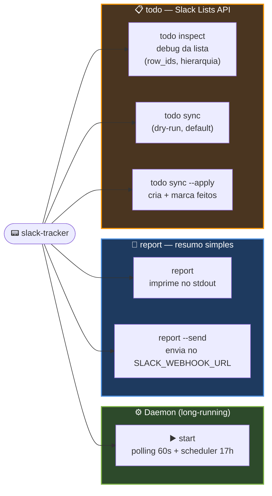

# Comandos

A CLI tem três subcomandos principais: `start`, `report` e `todo`. Todos definidos em [src/main.rs](../src/main.rs) via `clap`.

## Mapa da CLI



## `start` — daemon

Esse é o comando que eu deixo rodando o dia inteiro (em geral via systemd, veja [scheduler-e-servico.md](scheduler-e-servico.md)).

```bash
slack-tracker start
```

O que ele faz:

1. Abre o SQLite em `~/.local/share/slack-tracker/logs.db` (cria se não existir).
2. Sobe uma task em paralelo com o **scheduler diário**: dorme até `TODO_SYNC_TIME` e dispara o `todo sync` (em modo `--apply` se `TODO_SYNC_APPLY=true`). Se já passou do horário e ainda não rodou hoje, faz catch-up imediato.
3. Entra num loop que, a cada 60s, lê a janela ativa via `xdotool` (ou `xprop`) e grava em `activity_log`.

Não tem flag. É só ligar e esquecer.

### Logs típicos

```
[INFO] slack-tracker iniciado. db=".../logs.db", intervalo=60s
[INFO] scheduler iniciado — alvo diário 17:00 (apply=true)
[INFO] próximo todo sync: 2026-04-13 17:00:00 (em 67min)
[INFO] logged: Welcome - slack-tracker - Visual Studio Code (projeto: Some("VSCode:Welcome - slack-tracker"))
```

## `report` — resumo simples do dia

Gera bullet points do dia atual, prontos pra colar em um canal qualquer.

```bash
slack-tracker report           # imprime no stdout
slack-tracker report --send    # envia no SLACK_WEBHOOK_URL
```

Esse fluxo:

- agrupa os top projetos do dia no SQLite,
- acha a pasta git de cada um vasculhando `~`, `~/Projects`, `~/dev`, `~/Code`, `~/Documents`, `~/Área de trabalho` etc.,
- roda `git status --short`, `git diff --stat` e `git log --since=6am`,
- pede um resumo curtinho à LLM (Ollama ou OpenAI — Claude **não** é suportado neste comando).

Quando uso `--send`, o conteúdo final vai pro webhook como `{"text": "Resumo do dia:\n..."}`.

## `todo` — Slack Lists API

Tem dois subcomandos.

### `todo inspect`

```bash
slack-tracker todo inspect
```

Imprime a lista atual com hierarquia, `row_id` e status. Eu uso pra:

- conferir se o `SLACK_API_TOKEN` tem permissão na `SLACK_LIST_ID`,
- descobrir o `row_id` do pai da semana atual (o item cujo nome bate com `DD/MM/YYYY - DD/MM/YYYY` contendo hoje),
- ver os nomes exatos das subtarefas que já existem.

Saída típica:

```
=== Lista F0123456789 (42 itens) ===

• [ ] 07/04/2026 - 13/04/2026 (row_id=Rec123abc)
    ├─ [x] Implementei a tela de SSL no app (row_id=Rec456def)
    ├─ [ ] Atualizei a documentação de arquitetura (row_id=Rec789ghi)

Semana atual detectada: 07/04/2026 - 13/04/2026 (row_id=Rec123abc)
```

### `todo sync`

```bash
slack-tracker todo sync           # dry-run (default)
slack-tracker todo sync --apply   # aplica de verdade
```

O fluxo (já está mais detalhado em [arquitetura.md](arquitetura.md)):

1. Encontra o item-pai da semana atual.
2. Coleta atividade rica de cada `PROJECT_ROOTS`: commits desde meia-noite, diff, status, arquivos modificados (mtime), tempo de tela.
3. Envia tudo + a lista atual ao LLM com o `SYSTEM_PROMPT_TODO` (primeira pessoa, máx 10 itens, não duplica nada).
4. Devolve um JSON `{"novos": [...], "marcar_feito": [...]}` que vira:
   - novas subtarefas (criadas com `done=true` e data de hoje), e
   - subtarefas existentes marcadas como concluídas.

#### Dry-run

Sem `--apply`, o comando só imprime o plano:

```
Semana: 07/04/2026 - 13/04/2026
Modo: DRY RUN

+ Novos itens (3):
  + Adicionei a documentação completa em pt-br
  + Implementei o scheduler diário das 17h
  + Corrigi o fallback do xprop quando xdotool falha

✓ Marcar como feitos (1):
  ✓ Comecei a base do slack-tracker (Rec789ghi)

(dry run — nada foi enviado ao Slack. Use --apply para efetivar.)
```

Sempre rodo dry-run pelo menos uma vez quando mudo algo no prompt ou nos `PROJECT_ROOTS`, pra ver o que vai sair antes de aplicar.

#### Apply

Com `--apply`:

```
Aplicando na Slack List...
[INFO] criado (feito + data hoje): Adicionei a documentação completa em pt-br (row_id=Rec...)
[INFO] criado (feito + data hoje): ...
[INFO] marcado feito: Rec789ghi
Pronto.
```
