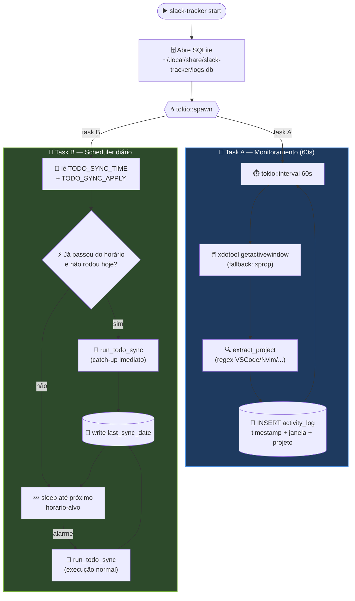
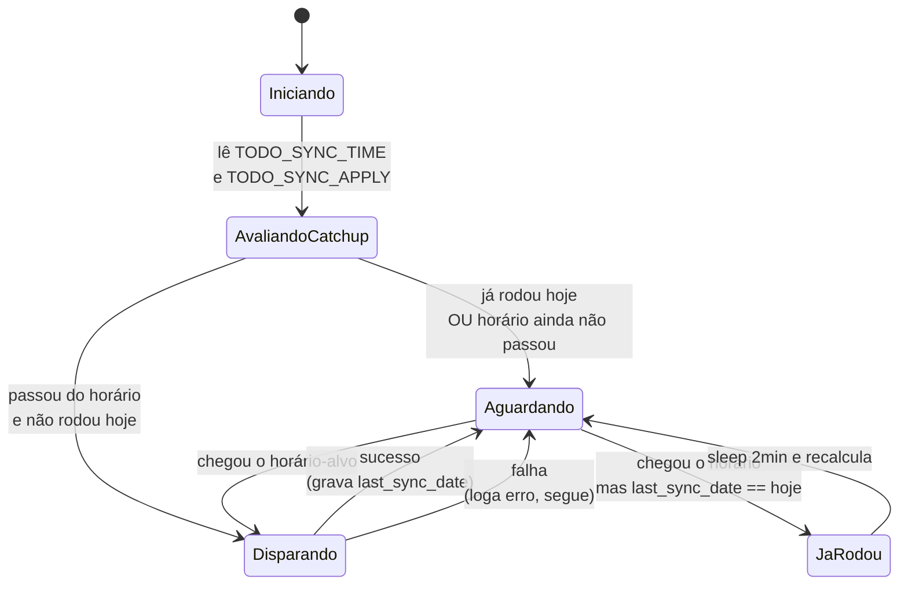

# Scheduler diário e serviço do systemd

## O scheduler interno

Quando rodo `slack-tracker start`, o daemon sobe duas coisas em paralelo:

- O loop de monitoramento (60s).
- Uma task `tokio` que dorme até `TODO_SYNC_TIME` e então dispara o `todo sync`.

### Visão das duas tasks paralelas



### Diagrama de estados do scheduler



Resumo prático: se eu reinicio o computador às 18h, o scheduler roda o sync imediatamente em vez de esperar até as 17h do dia seguinte. E se ele já tiver rodado hoje, ele só vai esperar a próxima janela.

## Como confiro que está agendado

Logo depois do `start`, no log:

```
[INFO] scheduler iniciado — alvo diário 17:00 (apply=true)
[INFO] próximo todo sync: 2026-04-13 17:00:00 (em 67min)
```

Se aparecer `apply=false`, o sync vai rodar mas em modo dry-run (não toca no Slack). Para mudar, eu preciso exportar `TODO_SYNC_APPLY=true` **antes** de subir o daemon.

## Rodando como serviço do systemd

Eu deixo isso ligado no login com um service de usuário. Em `~/.config/systemd/user/slack-tracker.service`:

```ini
[Unit]
Description=slack-tracker daemon
After=graphical-session.target

[Service]
ExecStart=%h/.local/bin/slack-tracker start
Restart=on-failure
Environment=DISPLAY=:0
Environment=TODO_SYNC_APPLY=true
Environment=TODO_SYNC_TIME=17:00
Environment=PROJECT_ROOTS=/caminho/absoluto/do/projeto
Environment=SLACK_API_TOKEN=xoxb-...
Environment=SLACK_LIST_ID=F0123456789
Environment=ANTHROPIC_API_KEY=sk-ant-...

[Install]
WantedBy=default.target
```

Habilitando:

```bash
systemctl --user daemon-reload
systemctl --user enable --now slack-tracker.service
```

Conferindo:

```bash
systemctl --user status slack-tracker.service
journalctl --user -u slack-tracker.service -f
```

> ⚠️ O systemd **não** carrega o meu `~/.zshrc`. Tudo o que eu uso no shell precisa estar duplicado em `Environment=` (ou em um arquivo `.env` na pasta de execução, porque o binário roda `dotenvy::dotenv_override()` no boot).

## Alternativa: arquivo `.env`

Se eu não quiser colocar segredos no service, posso apontar o `WorkingDirectory` para uma pasta que tenha um `.env`:

```ini
[Service]
WorkingDirectory=%h/.config/slack-tracker
ExecStart=%h/.local/bin/slack-tracker start
Environment=DISPLAY=:0
```

E em `~/.config/slack-tracker/.env`:

```
SLACK_API_TOKEN=xoxb-...
SLACK_LIST_ID=F0123456789
ANTHROPIC_API_KEY=sk-ant-...
PROJECT_ROOTS=/caminho/absoluto/do/projeto
TODO_SYNC_APPLY=true
TODO_SYNC_TIME=17:00
```

Com `chmod 600` nesse arquivo. É o jeito que eu prefiro porque mantém credenciais fora do unit file.

## Trocando o horário

Para mudar o horário do sync, basta atualizar `TODO_SYNC_TIME` e reiniciar:

```bash
systemctl --user restart slack-tracker.service
```

O scheduler recalcula no boot.

## Parando temporariamente

Quando eu quero pular um dia (férias, dia de reuniões, etc):

```bash
systemctl --user stop slack-tracker.service
```

E depois:

```bash
systemctl --user start slack-tracker.service
```

> Se eu parei depois das 17h e quero pular o catch-up do dia seguinte, eu também posso editar `~/.local/share/slack-tracker/last_sync_date` pra colocar a data de amanhã. Hack feio, mas funciona.
